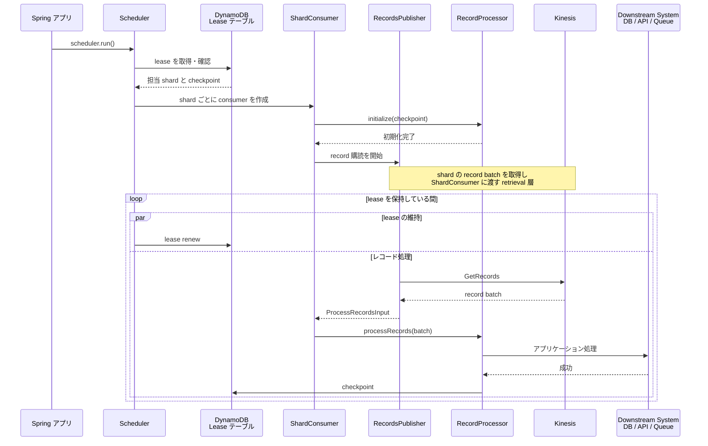
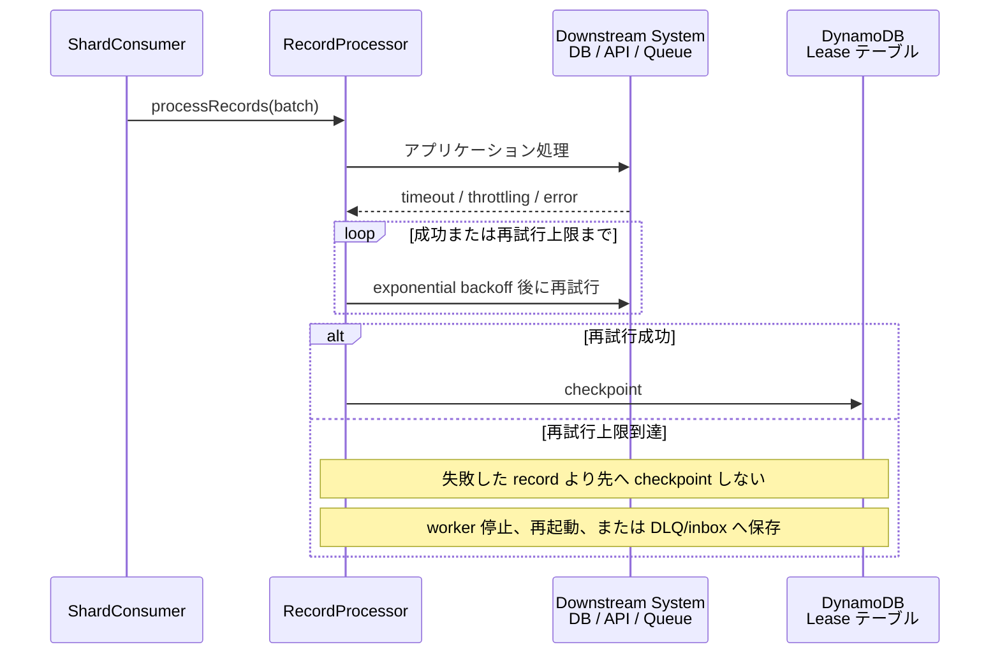
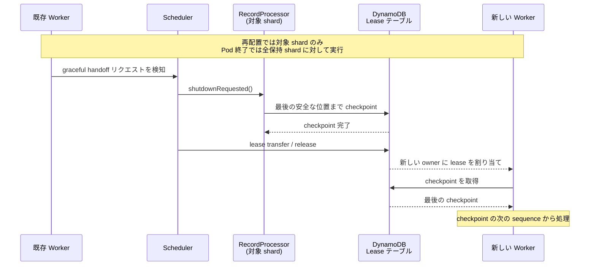
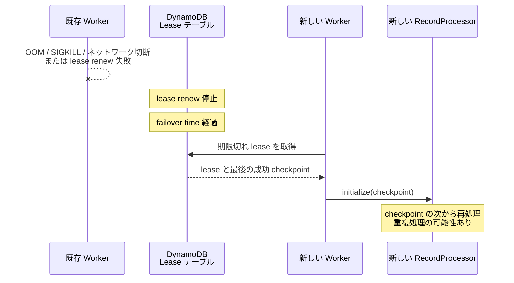
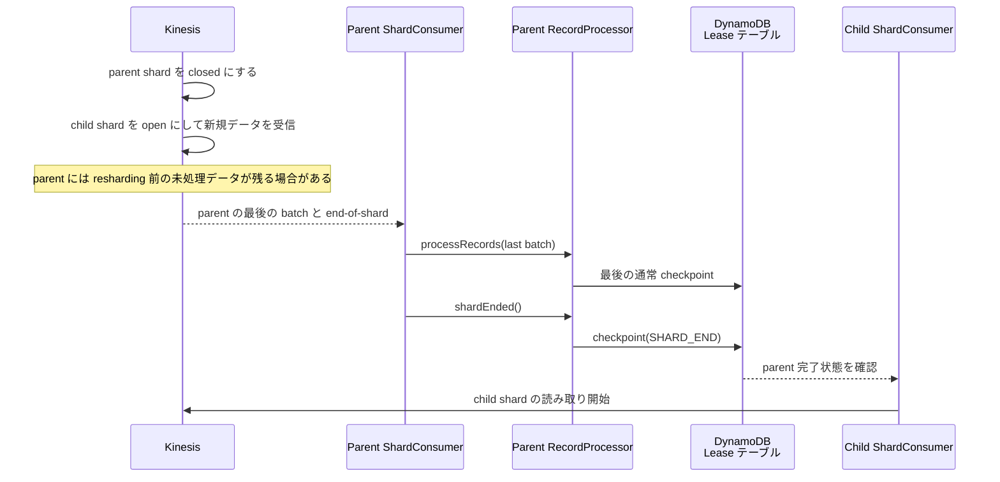
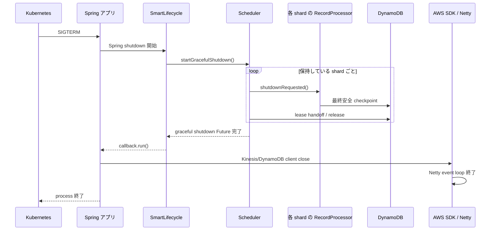
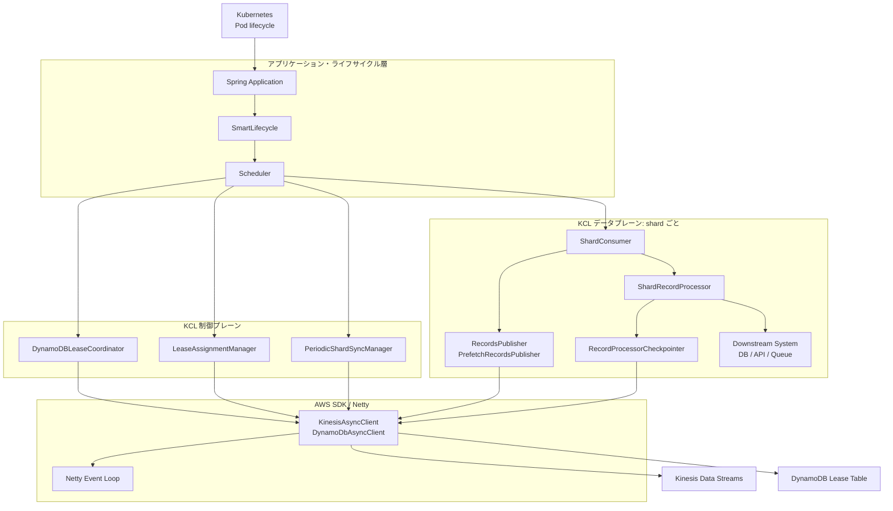
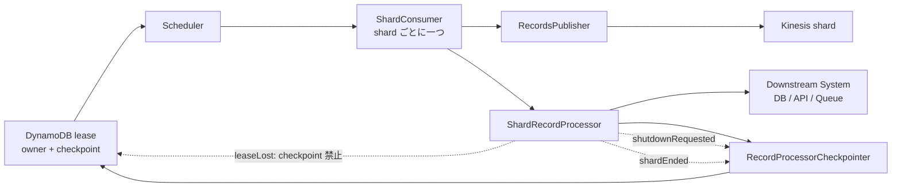

# KCL シーケンス集

## 1. 起動と通常処理



## 2. レコード処理中の一時障害



## 3. Graceful lease handoff: 再配置または Pod 終了



## 4. Pod 異常終了または lease 喪失



## 5. Resharding: split または merge



## 6. Pod の正常終了



## 重要な原則

`checkpoint` は「この sequence までの record が downstream system に安全に反映済み」であることを示します。失敗した record より先へ checkpoint してはいけません。

## コンポーネントの役割

| コンポーネント | 事実上の役割 | 保持・操作する主な状態 | 運用上の注意点 |
|---|---|---|---|
| `Scheduler` | KCL worker の中心となる実行ループ。割り当てられた shard ごとに `ShardConsumer` を作成・実行し、停止処理も統括する。 | 現在の shard assignment、`ShardConsumer` の集合 | `scheduler.run()` は一つの worker で一度だけ実行する。終了時は `startGracefulShutdown()` の完了を待つ。 |
| `DynamoDBLeaseCoordinator` | lease の取得、更新、release を管理する。内部で lease renewer、taker、discoverer を起動する。 | worker が現在保持する lease | renew に失敗し続けると lease が期限切れとなり、別 worker に引き継がれる。 |
| DynamoDB Lease Table | shard ごとの owner、checkpoint、lease counter、handoff 状態を永続化する。KCL worker 間で共有される。 | `leaseOwner`、`checkpoint`、`checkpointOwner` など | 業務データ用 DynamoDB テーブルとは役割が異なる。checkpoint はこのテーブルに記録される。 |
| `LeaseAssignmentManager` | KCL 3.x の lease assignment と再均衡を判断する。worker metric と lease 状態を基に、どの worker に lease を割り当てるか決める。 | lease の一覧、worker metric、assignment 計画 | leader が実行する制御系の処理。失敗すると再均衡や再割り当てが遅延する。 |
| `PeriodicShardSyncManager` | Kinesis の shard 構造と lease table を定期的に同期する。split / merge 後の shard を検出し、必要な lease を作成する。 | stream ごとの shard / lease の対応 | 失敗しても既存 shard の処理が直ちに失われるわけではないが、新しい shard の検出が遅れる。 |
| `ShardConsumer` | 一つの shard lease のライフサイクルを管理する。初期化、record 処理、shard 終了、lease 喪失、graceful handoff を状態遷移として扱う。 | shard ごとの lifecycle state、shutdown reason | worker 全体ではなく shard 単位のコンポーネント。 |
| `RecordsPublisher` / `PrefetchRecordsPublisher` | Kinesis から record batch を取得し、`ShardConsumer` に渡す。polling と prefetch queue を担当する。 | shard iterator、取得済み batch、prefetch queue | `GetRecords` 失敗は処理の遅延を意味する。checkpoint の更新とは別の層である。 |
| `ShardRecordProcessor` | アプリケーションが実装する shard ごとの処理ロジック。`initialize`、`processRecords`、終了 callback を受ける。 | アプリケーション固有の処理状態 | 処理の成功確認、idempotency、checkpoint の判断はアプリケーション責務。 |
| `RecordProcessorCheckpointer` | RecordProcessor に checkpoint API を提供し、許可された sequence の範囲を検証して lease table に checkpoint を保存する。 | 最後の checkpoint、checkpoint 可能な最大 sequence | checkpoint は「この位置まで安全に処理済み」という宣言。失敗 record より先に進めてはいけない。 |
| `shutdownRequested()` | lease を正常に handoff する前に、対象 shard の RecordProcessor へ最終 checkpoint の機会を与える callback。 | 対象 shard の checkpointer | Pod 全体の終了を必ず意味しない。再均衡で一つの shard だけ移動する場合にも呼ばれる。 |
| `leaseLost()` | worker が shard の lease を失ったことを通知する callback。 | なし | この時点では ownership が保証されないため checkpoint してはいけない。 |
| `shardEnded()` | Kinesis shard が closed になり、最後の record まで到達したことを通知する callback。 | `SHARD_END` checkpoint | `SHARD_END` checkpoint が成功するまで、child shard の開始が待機する場合がある。 |
| AWS SDK Async Client | Kinesis、DynamoDB、CloudWatch などへの API 呼び出しを実行する client。 | HTTP connection pool、request future | KCL の graceful shutdown 完了前に `close()` してはいけない。 |
| Netty Event Loop | AWS SDK async HTTP client の I/O と callback 実行を担う thread / executor。 | HTTP channel、event loop task queue | `event executor terminated` は event loop が終了済みであることを示す。KCL が API 呼び出し中なら shutdown 順序の問題となる。 |
| Spring `SmartLifecycle` | Spring context の start / stop phase で非同期 component の完了を callback として通知できる lifecycle API。 | running 状態、stop callback | KCL graceful shutdown を完了してから AWS SDK client を破棄するための管理点として使える。 |
| Kubernetes | Pod に SIGTERM を送信し、`terminationGracePeriodSeconds` を過ぎても終了しない process を強制停止する。 | Pod の終了猶予時間 | 猶予時間は KCL の処理中 batch、最終 checkpoint、handoff に必要な時間より長く設定する。 |

## 全体構成とレイヤー



## shard 処理の内部関係



構成図は「誰が誰を管理・呼び出すか」を、sequence diagram は「いつ何が起きるか」を表します。両方を併用すると、KCL の全体像と障害時の流れを分けて確認できます。

## QA

### Q1. `processRecords()` で例外を投げると、KCL はどのように動作するか？

A. KCL の `ProcessTask` は `ShardRecordProcessor.processRecords()` 呼び出しで発生したアプリケーション例外を捕捉し、失敗した record を示すログを残せる。その例外を「同じ batch を必ず再配信する要求」として扱うわけではない。task の lifecycle は継続し、後続の record batch が `processRecords()` に渡される可能性がある。

したがって、`throw` だけで同一 batch の自動再試行を期待してはいけない。特に危険なのは、失敗した batch の後で別 batch の処理が成功し、より大きい sequence number に checkpoint するケースである。checkpoint はその sequence 以下がすべて安全に処理済みであることを意味するため、未解決の失敗 record まで再開対象から外れてしまう。

```text
checkpoint: 100
batch A: 101-120 -> 110 で処理失敗
batch B: 121-140 -> 処理成功
checkpoint: 140

再起動後: 141 から再開
結果: 110 を含む 101-120 が再取得されない
```

失敗時のアプリケーション側の選択肢は、同じ record または batch を成功するまで再試行する、耐久的な DLQ/inbox に保存してから処理済みとして扱う、または worker を停止して最後の安全な checkpoint から再開する、のいずれかである。失敗をログだけで終わらせ、後続 checkpoint を許可する実装は避ける。

### Q2. record を処理した後に checkpoint を更新しなければ、次の record は処理されないか？

A. 処理される。checkpoint は Kinesis の live な読み取り cursor を止める仕組みではなく、DynamoDB lease table に保存される**永続的な再開位置**である。worker が lease を保持し、`RecordsPublisher` が正常に動作している限り、KCL は shard iterator を進めて後続 record を取得し、`processRecords()` を呼び続けられる。

```text
Kinesis の in-memory iterator: 100 -> 101 -> 102 -> 103 -> ...
DynamoDB checkpoint:          100 のまま
```

この状態で Pod が再起動する、lease を失う、または failover が起きると、新しい worker は DynamoDB にある checkpoint 100 を基準に開始する。そのため 101 以降は再配信され、重複処理が起きる。これは KCL の at-least-once セマンティクスとして正常な挙動である。

一方で、checkpoint を更新しないことは「失敗 record より先へ進んでも安全」という意味ではない。KCL が後続 record を読み続けるため、アプリケーションは安全に処理済みの**連続区間**だけを checkpoint しなければならない。batch 全体が成功した後に checkpoint する、または最後に連続して成功した sequence を明示的に管理する必要がある。

### Q3. KCL が Exactly-once ではなく At-least-once を基本とする技術的・経済的な理由は何か？

A. KCL が管理できるのは主に「Kinesis のどこまで読んだか」という shard ごとの checkpoint であり、アプリケーションが更新する downstream system の状態までは管理できない。end-to-end Exactly-once を実現するには、少なくとも次の三つを一つの原子的な commit として扱う必要がある。

```text
1. source の読み取り位置
2. consumer の内部状態
3. downstream system への副作用
```

Kinesis の checkpoint は DynamoDB lease table、業務処理は任意の DB・API・queue に書き込まれる。この複数システムをまたぐ原子性には、分散 transaction、two-phase commit、または sink 側の transaction / idempotency が必要になる。これらは write latency、可用性、運用複雑性、障害復旧コストを増加させる。

At-least-once は、downstream の成功後に checkpoint を保存するだけで「損失を避ける」設計を実現できる。checkpoint 保存前に障害が起きた場合は record を再配信するため、重複は発生し得るが損失を回避しやすい。Kinesis Data Streams の KCL は at-least-once 処理を前提とする。したがって、重複の排除は KCL ではなく downstream の idempotency で担保するのが基本となる。

### Q4. KCL で重複データが発生する代表的なシナリオは何か？

A. 最も代表的なのは、downstream の処理成功と checkpoint 保存の間に障害が起きるケースである。

```text
record 101 の downstream 処理成功
-> checkpoint 101 を保存する前に Pod crash
-> 新しい worker は checkpoint 100 から開始
-> record 101 を再処理
```

他にも次のケースで重複が起きる。

- DynamoDB lease table への checkpoint 更新が失敗した後、worker が再起動・failover する。
- lease renew の失敗、network partition、OOM、SIGKILL により worker が lease を失う。
- graceful handoff 時に `shutdownRequested()` 内の最終 checkpoint が未実装、失敗、または timeout する。
- downstream request が timeout し、実際には成功したか失敗したか判定できないため、同じ idempotency key で再試行する。
- resharding や deployment のタイミングで、最後の保存済み checkpoint より後の record が再配信される。

重複は異常ではなく recovery の正常動作として扱う。downstream system には event ID、または shard ID と extended sequence number を用いた idempotency key を持たせる。

### Q5. KCL は checkpoint をどこに、どのように記録するか？ checkpoint 更新でエラーが起きるとどうなるか？

A. KCL は DynamoDB lease table の lease item に checkpoint を記録する。checkpoint は shard ごとの sequence number であり、KPL aggregation を使用する場合は sub-sequence 情報も扱う。KCL は現在の worker が lease を保持していることを確認する条件付き更新として checkpoint を保存し、lease ownership を失った worker が古い checkpoint を書き込むことを防ぐ。

checkpoint 更新に失敗した場合、checkpoint は前進しない。次の worker は最後に成功した checkpoint から再開するため、すでに downstream に反映済みの record が再配信される可能性がある。これは at-least-once として期待される動作である。

失敗理由により判断は異なる。

- `ShutdownException`: lease を失った可能性がある。checkpoint を再試行せず、`leaseLost()` として扱う。
- `InvalidStateException`: lease table の状態・設定・アクセスに問題がある。修復されるまで安全な checkpoint はできない。
- `DependencyException`、timeout、throttling: 一時障害の可能性がある。ownership が有効な間だけ再試行し、成功しなければ failover 時の再配信を前提にする。

### Q6. resharding 時に、重複と順序保証で何に注意するか？

A. split または merge が起きると、parent shard は closed になり、新しい child shard は open になって新規 write を受け始める。child shard には、consumer が parent の backlog を読み切る前から record が蓄積し得る。

KCL は parent shard の最後の record を処理し、`shardEnded()` で `SHARD_END` checkpoint を保存してから child shard の処理を開始する。split の child、merge の child はすべての parent の完了を待つため、shard lineage に沿った処理順を維持する。

ただし、これは stream 全体の total order を意味しない。もともと異なる shard 間には total order がなく、Kinesis が保証する順序は shard 内および partition key の系統に限られる。`SHARD_END` checkpoint が失敗すると child 処理が遅延する。resharding 自体は正常動作で重複を必ず発生させるものではないが、parent 完了前後の障害・再試行・checkpoint 失敗では通常どおり重複を考慮する。

### Q7. 重複を絶対に許容できず、Exactly-once に近い処理が必要な場合の選択肢は何か？

A. 任意の external system を含む end-to-end Exactly-once を、KCL だけで提供する選択肢はない。まず、何を一度だけにしたいのかを分けて定義する必要がある。

```text
KCL の record 配信を一度だけにしたい
-> KCL 単体では不可。再配信を前提にする。

業務データへの効果を一度だけにしたい
-> downstream を idempotent / transactional にする。

ストリーム処理エンジン内部の state を一度だけ更新したい
-> Apache Flink の exactly-once checkpointing を検討する。
```

現在のように DynamoDB を downstream に使う場合は、`eventId` または `shardId + extendedSequenceNumber` を処理済みキーとして保存し、業務 item の更新と処理済みキーの登録を DynamoDB `TransactWriteItems` で同時に行う設計が現実的である。KCL の checkpoint は別 transaction になるため再配信自体は起き得るが、業務上の効果を一度だけにできる。

複数 operator を持つ stateful stream processing が必要なら、Amazon Managed Service for Apache Flink または Apache Flink を検討する。Flink は checkpoint により operator state を exactly-once で復元できる。ただし外部 sink まで Exactly-once にするには、source が replay 可能であり、sink が transactional または idempotent でなければならない。Flink の DynamoDB sink は at-least-once であるため、DynamoDB 側の idempotency は引き続き必要になる。

Kafka / Amazon MSK を中心に設計できる場合は、Kafka transaction と `read_committed` consumer を組み合わせた Exactly-once sink を選べる。ただしこれは transaction に参加する Kafka の範囲での保証であり、外部 DB や API まで自動的に Exactly-once になるわけではない。

### Q8. KCL の `耐障害性` とは何か？

A. worker、Pod、process、network の一部が失敗しても、別 worker が shard の処理を引き継ぎ、最後の成功 checkpoint から再開できる性質を指す。KCL は DynamoDB lease table を共有状態として使い、各 worker が保持中の lease を定期的に renew する。

```text
worker A が shard-001 の lease を保持
-> worker A が crash、または lease renew が停止
-> failover time 経過後に lease が期限切れ
-> worker B が shard-001 の lease を取得
-> worker B が DynamoDB の最後の checkpoint から再開
```

この仕組みにより、単一 worker の障害で shard 処理が永続的に停止しにくくなる。ただし、耐障害性は次の意味ではない。

- **Exactly-once ではない。** checkpoint 保存前に処理済みだった record は再配信され得る。
- **データ損失を完全に防ぐものではない。** 失敗 record より先に checkpoint した、Kinesis retention を超えて停止した、または downstream 側でデータを失った場合は KCL だけでは復元できない。
- **無停止を保証するものではない。** failover time、lease 取得、初期化には遅延がある。その間は対象 shard の処理が止まる。
- **すべての障害を自動修復するものではない。** IAM 設定、DynamoDB lease table の削除・破損、Kinesis 側の継続的な障害、アプリケーション bug は別途修復が必要になる。

実務上は、耐障害性を「失敗しても最後の安全な checkpoint に戻り、重複を許容して処理を再開できる設計」と捉える。したがって、checkpoint の正しさ、downstream の idempotency、Kinesis retention、複数 worker の配置が耐障害性の前提となる。

## 参考資料

- [AWS: Kinesis Client Library を使用する](https://docs.aws.amazon.com/streams/latest/dev/kcl.html)
- [AWS: KCL record processor の実装](https://docs.aws.amazon.com/streams/latest/dev/kinesis-record-processor-implementation-app-java.html)
- [AWS: Managed Service for Apache Flink の再起動と checkpoint](https://docs.aws.amazon.com/managed-flink/latest/java/troubleshooting-rt-restarts.html)
- [Apache Flink: Fault Tolerance と Exactly-once](https://nightlies.apache.org/flink/flink-docs-stable/docs/learn-flink/fault_tolerance/)
- [Apache Flink: Source と Sink の Fault Tolerance Guarantees](https://nightlies.apache.org/flink/flink-docs-release-2.3/docs/connectors/datastream/guarantees/)
