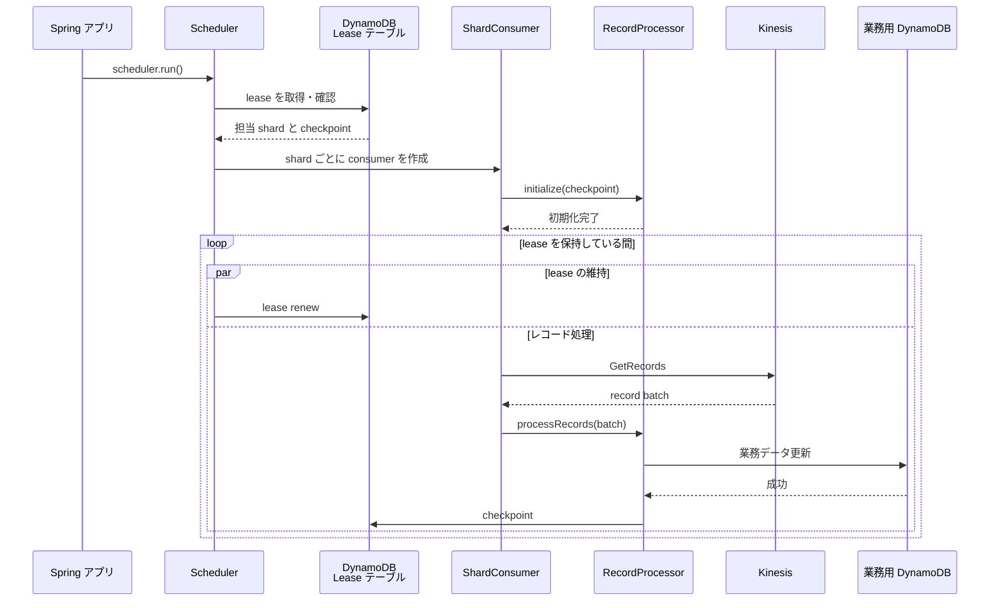
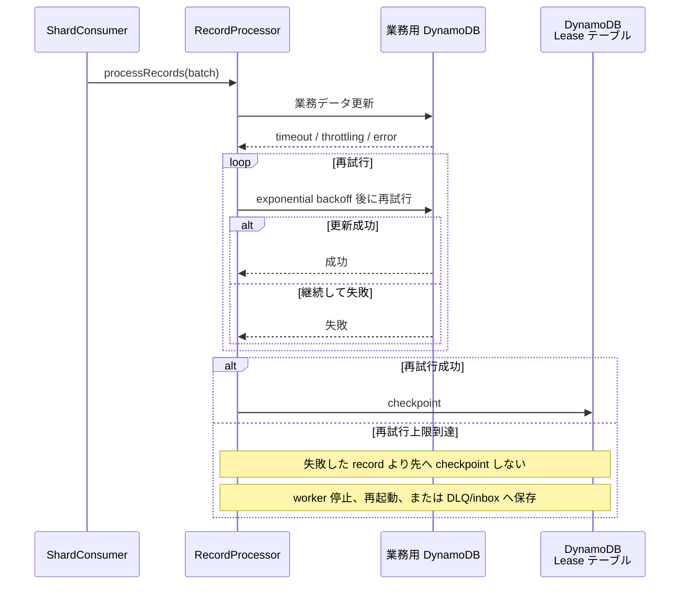
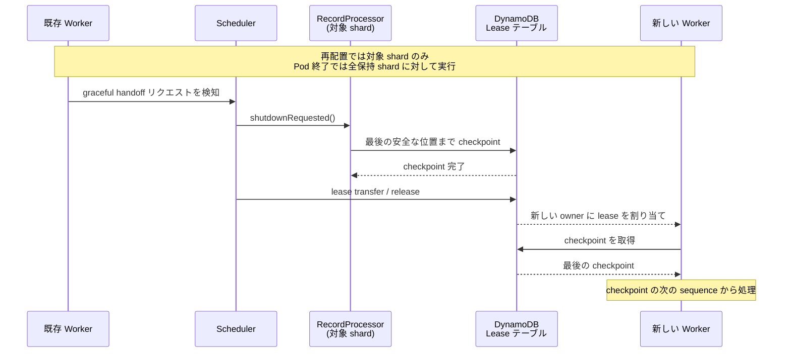
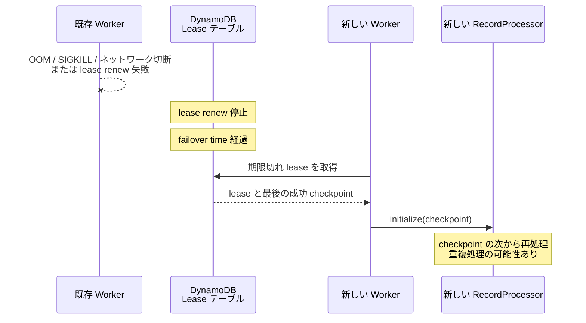
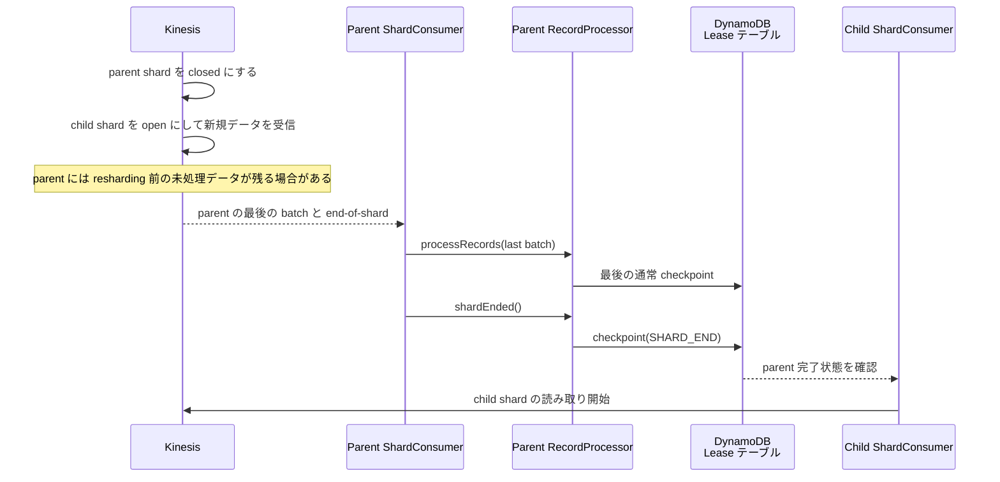
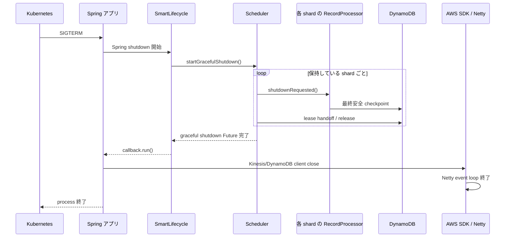

# KCL シーケンス集

## 1. 起動と通常処理

## 2. Downstream DynamoDB の一時障害

## 3. Graceful lease handoff: 再配置または Pod 終了

## 4. Pod 異常終了または lease 喪失

## 5. Resharding: split または merge

## 6. Pod の正常終了

## 重要な原則

`checkpoint` は「この sequence までの record が downstream に安全に反映済み」であることを示します。業務用 DynamoDB の更新に失敗した record より先へ checkpoint してはいけません。
